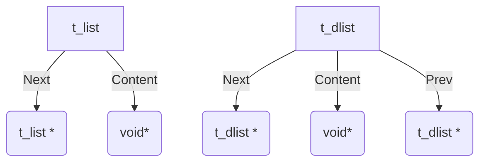

# Linked list lib

This is a page describing the list module of the ft_lib of bgoulard for c projects at 42 school.

## Dependencies

**Self libs**

- Ft_string
- Ft_list

**System functions**

- Open
- Close
- Write
- Free

## Structures

“simple” linked list are represented by t_list

“doubly” linked list are represented by t_dlist

Here is a graph of their structure

## Functions

They posses the following functions:

### TODO:

- [x]  All lst function from ft lib
- [x]  All dl nodes from personal stack lib
    
    
    - [ ]  Compliance between dl and lst functions
        - [ ]  dl
            - [ ]  add_back
            - [ ]  add_front
            - [ ]  rev
            - [ ]  map
        - [ ]  lst
            - [ ]  iter_range
            - [ ]  iter_range_node
            - [ ]  size_match
            - [ ]  create
            - [ ]  copy
            - [ ]  copy_list
            - [ ]  del_range
            - [ ]  get_datas
            - [ ]  get_nodes
            - [ ]  at
            - [ ]  push
            - [ ]  push_back
            - [ ]  pop
            - [ ]  pop_front
            - [ ]  subrange
    - [ ]  Stack structure W/ functions (control for node + cached values/mem/whatever)
    - [ ]  functions to add
        - [ ]  find
        - [ ]  rfind
        - [ ]  create_from_array
        - [ ]  ? create from vec ?
- [x]  Split functions header from struct header
- [x]  Rename predicate to ft_list
- [ ]  Rename predicate of ft_list_dl% to ft_dl% and ft_list% to ft_lst%
- [ ]  ? Tree structure/functions ?
- [ ]  ? Circular support ?

legacy compliance chart with missing functions and duplicate functions

| doubly linked list | Simply linked list
 |
| --- | --- |
| apply
apply_range
apply_range_node | iter
X
X |
| size
size_of_data | size
X |
| () - (rename to ft_list_dl_new asap)
create
copy
copy_list | new
X
X
X |
| delete_self
delete_range
delete | delone
X
clear |
| get_datas
get_nodes | X
X |
| at
end
begin
count (duplicate of size in better will be renamed) | X
last
- (unneeded)
size |
| push_back
push
pop_back
pop | X
X
X
X |
| subrange
subrange_to - (duplicate of upper remove asap) | X
- (unneeded) |
| X
X | add_back
add_front |
| X | rev |
| X | map |